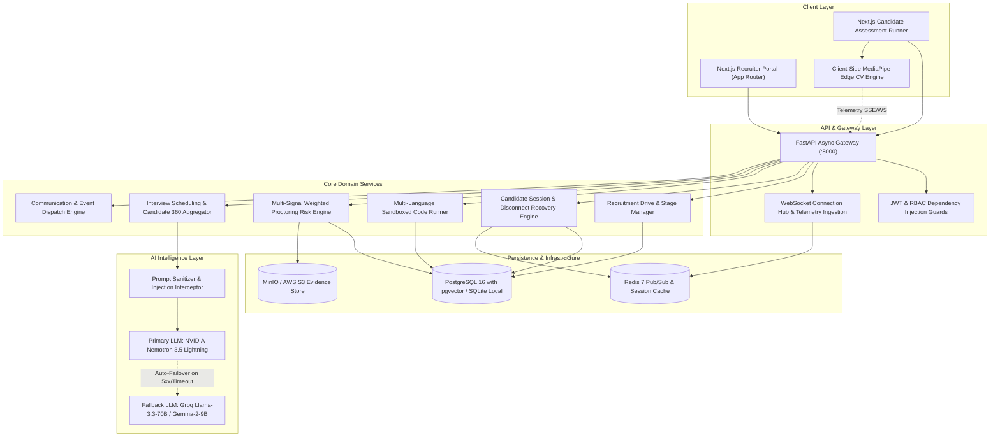
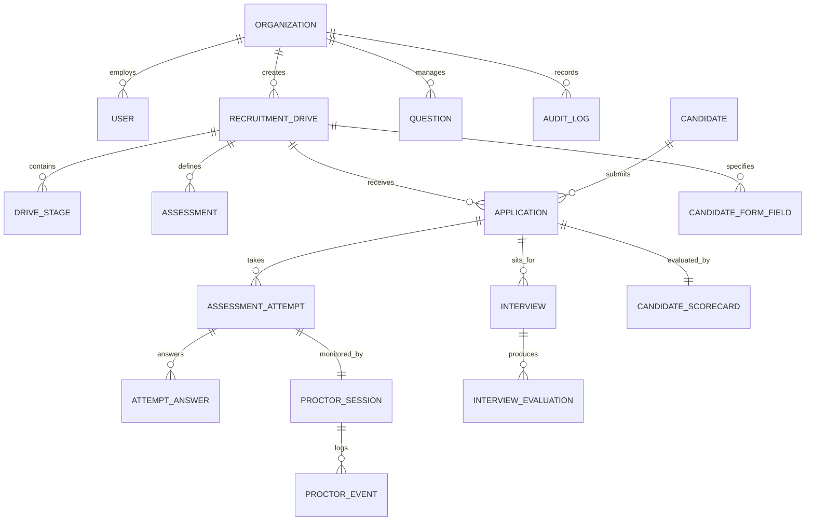

# Autergo Enterprise Recruitment Platform — System Architecture & Technical Design Document

**Version**: 1.0.0  
**Architect**: DeepMind Antigravity Engineering  
**Status**: Implemented & Operational  

---

## 1. System Context & Top-Level Architecture

The platform is designed following a **Clean Modular Monolith** architecture with clear service boundaries, asynchronous event loops, real-time WebSockets, and a multi-tier LLM failover strategy.

---

## 2. Component Design & Layer Responsibilities

### 2.1 Backend Layering (`/backend/app`)
- **`api/v1/`**: Endpoint routing, HTTP parameter parsing, Pydantic request/response serialization, status codes.
- **`core/`**: Database engine creation, Redis pool, JWT token generation/validation, password hashing, and central configuration.
- **`models/`**: SQLAlchemy 2.0 ORM declarations with universal JSON serialization, relationships, and foreign key cascades.
- **`schemas/`**: Strict Pydantic v2 schemas for data contracts.
- **`services/`**:
  - `llm_service.py`: Multi-provider LLM orchestration with streaming generators and input sanitization.
  - `sandbox_service.py`: Subprocess isolation for Python, Node.js, C++, Java, and SQL execution with timeout kills.
  - `risk_engine.py`: Weighted anomaly scoring formula:
    $$\text{RiskScore} = \min\left(100, \sum w_i \times \text{Count}_i \times \text{Confidence}_i\right)$$
  - `audit_service.py`: Immutable change recording for all administrative actions.

### 2.2 Frontend Layering (`/frontend/src`)
- **`app/(auth)/`**: Login and recruiter authentication flows.
- **`app/(recruiter)/`**:
  - `dashboard/`: Overview of active drives and applicant velocity.
  - `drives/create/`: 8-step creation wizard.
  - `drives/[id]/`: Pipeline Kanban and candidate management.
  - `drives/[id]/live/`: Live WebSocket command center.
  - `drives/[id]/candidate360/`: Unified candidate evaluation profile.
  - `questions/`: Question bank and streaming AI question generator.
  - `interviews/`: Interview scheduling and structured rubric evaluations.
- **`app/(candidate)/`**:
  - `test/[token]/verify/`: Magic link validation + OTP input.
  - `test/[token]/readiness/`: Camera, microphone, and browser compatibility verification.
  - `test/[token]/take/`: Timed question runner, Monaco code editor, test case assertion panel, and auto-save.

---

## 3. Database Schema & Entity Relationship Diagram

---

## 4. Multi-Tier AI Architecture & Guardrails

1. **Routing Strategy**:
   - Every AI request is dispatched first to **NVIDIA Cloud API** (`nvidia/nemotron-3.5-lightning-30b-a3b`).
   - If NVIDIA returns an HTTP error or exceeds latency SLAs, the request is rerouted in real time to **Groq API** (`llama-3.3-70b-versatile` or `gemma2-9b-it`).
2. **Safety & Injection Defense**:
   - System prompts enforce strict JSON output formatting.
   - User inputs are scanned for prompt injection attacks (`ignore previous instructions`, `system override`, `jailbreak`) before hitting the LLM.
3. **Human-in-the-Loop (HITL)**:
   - AI generates scoring recommendations, summaries, and questions.
   - Disqualification, score overrides, and final hiring statuses require recruiter approval.
