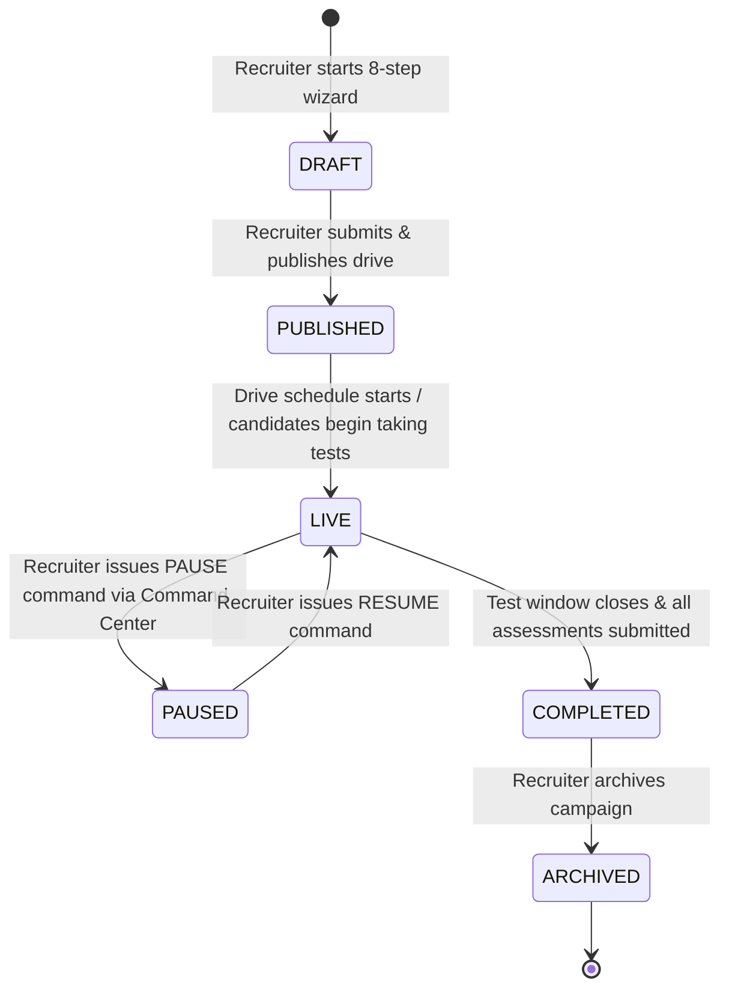
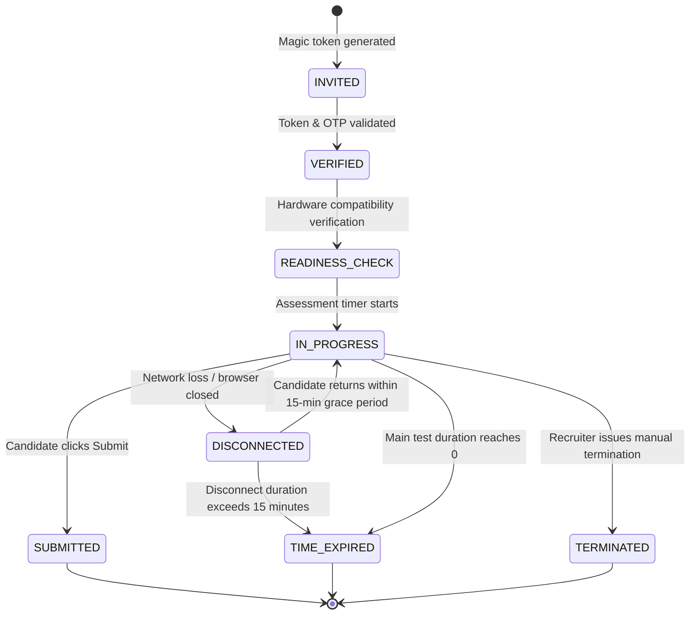

# Autergo Enterprise Recruitment Platform — Feature Flow & State Lifecycle Document

**Document Version**: 1.0.0  
**Status**: Approved & Active  

---

## 1. Recruitment Drive Lifecycle State Machine



| State | Allowed Actions | Visibility |
|---|---|---|
| **`DRAFT`** | Edit configurations, modify questions, delete draft | Recruiter & Admin only |
| **`PUBLISHED`** | View share link, invite candidates via CSV, schedule interviews | Public registration enabled |
| **`LIVE`** | Real-time monitoring, extend time, pause/resume test session | Live WebSocket Command Center active |
| **`PAUSED`** | Recruiter emergency hold, candidate timer frozen | Candidate test runner shows pause screen |
| **`COMPLETED`** | Candidate 360 review, interview rubric grading, final hiring decisions | Test taking disabled |
| **`ARCHIVED`** | Read-only historical analytics and audit log export | Archived records |

---

## 2. Candidate Assessment Session State Machine



---

## 3. End-to-End Recruitment Feature Flow

```mermaid
flowchart TD
    subgraph Phase 1: Campaign Setup
        A1[Recruiter creates Drive] --> A2[Define Custom Form Schema]
        A2 --> A3[Assemble Assessment Questions]
        A3 --> A4[Configure Proctoring Flags]
        A4 --> A5[Publish & Generate Public Links]
    end

    subgraph Phase 2: Candidate Sourcing & Assessment
        B1[Candidate receives invite link] --> B2[Zero-Account OTP Login]
        B2 --> B3[Camera & Mic Hardware Check]
        B3 --> B4[Timed Assessment Runner]
        B4 --> B5[Monaco Code Editor & Sandbox Tests]
        B4 --> B6[Client-Side CV Anomaly Streaming]
        B5 --> B7[Incremental Auto-Save]
        B7 --> B8[Submit Final Assessment]
    end

    subgraph Phase 3: Operations & Integrity
        C1[Live Recruiter Command Center] --> C2[Real-Time Anomaly Stream]
        C2 --> C3[Reviewer Suspicion Timeline Adjudication]
        C3 --> C4[Scorecard & Risk Band Finalization]
    end

    subgraph Phase 4: Interview & Hiring
        D1[Automated Shortlist Notification] --> D2[Multi-Round Interview Scheduling]
        D2 --> D3[AI Skill Gap Question Suggester]
        D3 --> D4[Structured Rubric Evaluation Form]
        D4 --> D5[Candidate 360 Scorecard]
        D5 --> D6[Hiring Decision: Strong Hire / Hire / Hold / Reject]
    end

    Phase 1 --> Phase 2
    Phase 2 --> Phase 3
    Phase 3 --> Phase 4
```
