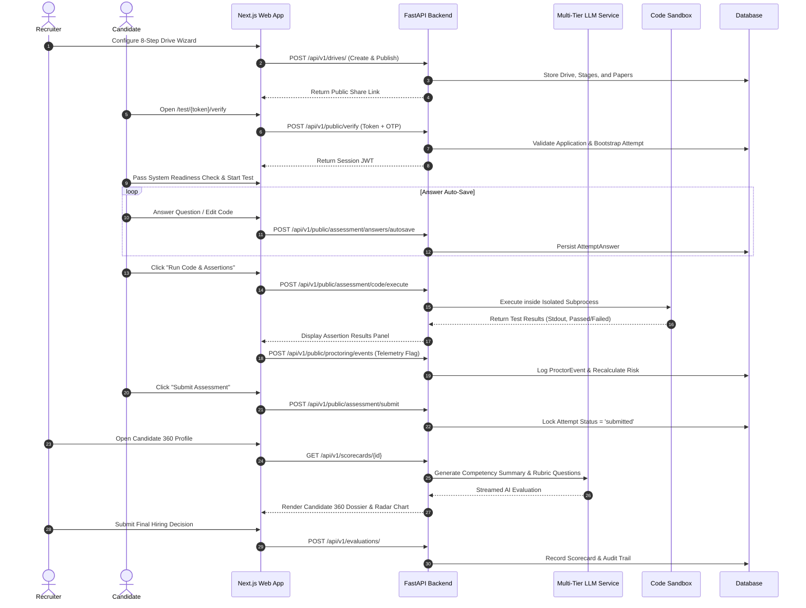

# Autergo Enterprise Recruitment Platform — Use Cases & Functional Flow Document

**Document Version**: 1.0.0  
**Status**: Approved & Active  

---

## 1. Primary Use Cases

### UC-01: Recruiter Configures & Launches Recruitment Drive
- **Primary Actor**: Recruiter
- **Preconditions**: Recruiter logged in with active tenant credentials.
- **Main Flow**:
  1. Recruiter clicks **"Create Recruitment Drive"**.
  2. Completes **8-Step Wizard**:
     - *Step 1: Campaign Basics* (Job title, department, description).
     - *Step 2: Eligibility Rules* (Graduation year, minimum CGPA/score).
     - *Step 3: Custom Form Fields* (Resume upload, portfolio URL, custom text).
     - *Step 4: Pipeline Stages* (Online Test, Technical Interview, HR Interview).
     - *Step 5: Assessment Paper Assembly* (MCQs, coding challenges, duration, cutoff).
     - *Step 6: Proctoring Configuration* (Webcam enforcement, phone detection, tab limits).
     - *Step 7: Automated Communications* (Invitation email, shortlist notification templates).
     - *Step 8: Review & Publish*.
  3. System publishes drive, sets state to `published`, and generates unique public share links.
- **Postconditions**: Drive is open for candidate registration and CSV bulk invitation.

---

### UC-02: Candidate Takes Zero-Account Timed Assessment
- **Primary Actor**: Candidate
- **Preconditions**: Candidate received magic invitation token link via email.
- **Main Flow**:
  1. Candidate navigates to `/test/{token}/verify`.
  2. System validates invitation token and prompts for Candidate Email & OTP.
  3. Candidate inputs OTP (`123456` in demo mode); system establishes verified session.
  4. Candidate completes **System Readiness Check**:
     - Camera video stream check.
     - Microphone audio test.
     - Browser full-screen & tab switch monitoring check.
  5. Candidate enters **Assessment Runner**:
     - Reads instructions and begins timed session.
     - Solves MCQs and coding challenges in the Monaco editor.
     - Tests code against live unit test cases in the sandbox runner.
     - Incremental answers auto-save on every change.
  6. Candidate clicks **Submit Assessment** or timer expires.
- **Postconditions**: Assessment attempt marked as `submitted`, score compiled, and results transmitted to the Recruiter Command Center.

---

### UC-03: Multi-Signal Proctoring & Reviewer Adjudication
- **Primary Actors**: Edge CV Tracker, Risk Engine, Recruiter Reviewer
- **Main Flow**:
  1. While candidate is taking the test, client-side CV tracks face presence and detects anomalies (multiple faces, face missing, mobile phone in frame).
  2. Client-side browser logs tab switches and copy/paste keystrokes.
  3. Anomaly telemetry events are streamed via WebSocket / SSE to backend `/api/v1/public/proctoring/events`.
  4. Backend Risk Engine aggregates weighted suspicion scores and assigns risk tier (`Normal`, `Suspicious`, `Critical`).
  5. Recruiter accesses **Suspicion Timeline**:
     - Views chronological flags with confidence percentages and event metadata.
     - Selects **Confirm Violation**, **Mark for Review**, or **Ignore**.
- **Postconditions**: Human decision recorded in audit trail; candidate overall risk score finalized.

---

### UC-04: Technical Interviewer Conducts Interview with Candidate 360
- **Primary Actor**: Technical Interviewer
- **Preconditions**: Candidate shortlisted from assessment stage.
- **Main Flow**:
  1. Interviewer opens `/interviews` and selects scheduled candidate session.
  2. Interviewer reviews **Candidate 360 Profile**:
     - Assessment breakdown scores across individual skills.
     - Code execution details and proctoring integrity rating.
     - AI-generated candidate summary highlighting competency strengths and skill gaps.
     - AI-recommended follow-up interview questions targeting weak areas.
  3. Interviewer grades candidate using structured 5-point rubric (Problem Solving, System Design, Code Quality, Communication).
  4. Interviewer submits hiring recommendation (**Strong Hire**, **Hire**, **Hold**, **Reject**).
- **Postconditions**: Rubric ratings recorded and aggregated into final hiring scorecard.

---

## 2. End-to-End Functional Flow Diagram

