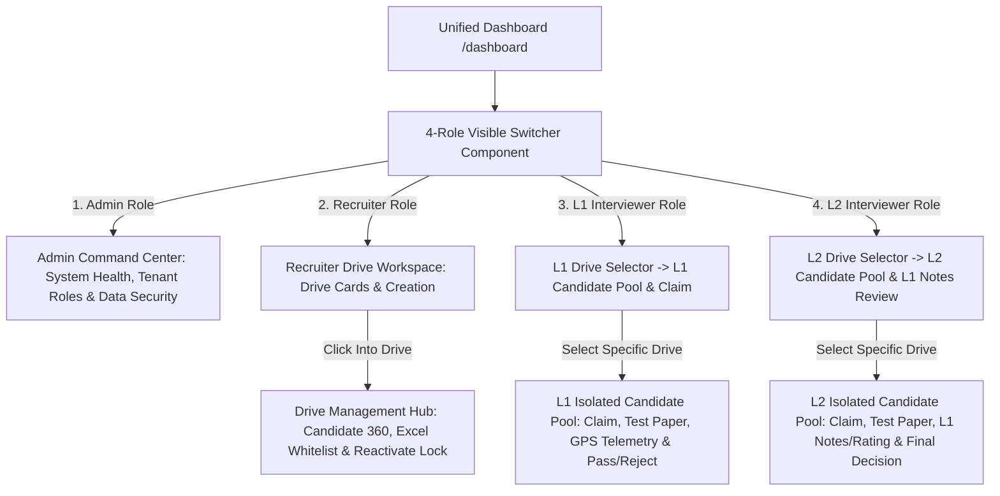

# Feature Specification: 4-Role Dashboard Switcher & Drive-Scoped Operations Architecture

**Feature Directory**: `specs/002-streamlined-recruitment-pipeline/`  
**Status**: Approved & Specified  
**Version**: 2.3.0  
**Domain**: Enterprise Recruitment, 4-Role RBAC & Drive-Scoped Lifecycle  

---

## 1. Overview & 4-Role Dashboard Operating Model

All internal platform capabilities are accessed via a **visible 4-Role Component Switcher** directly on the **Unified Dashboard (`/dashboard`)**. Clicking any of the 4 roles switches the view immediately into that role's dedicated, strictly-isolated workspace:

---

## 2. The 4 Distinct Role Workspaces

### 2.1 Role 1: Admin (`admin`)
- **Dashboard View**: Dedicated Admin Workspace.
- **Capabilities**:
  - Full system telemetry: Database engine health, active WebSocket connections, system uptime.
  - User role allocation: View and manage users across tenant roles.
  - Security audit logs: Candidate single-attempt verification status and anti-cheat alerts.

### 2.2 Role 2: Recruiter (`recruiter`)
- **Dashboard View**: Drive Overview & Campaign Creation.
- **Drive-Scoped Candidate Isolation**:
  - Outside of a drive: Recruiter sees drive summary cards, cutoff metrics, candidate counts, and **"+ Create New Drive"**.
  - Inside a drive (`/drives/[id]/pipeline`): Recruiter manages **only candidates belonging to that specific drive**:
    - Upload & parse Excel/CSV candidate whitelist.
    - View candidate test scores, device type, and live GPS coordinates.
    - **Reactivate / Unlock Candidate Attempt** (exclusive recruiter permission).
    - Share Drive Magic Link & QR Code.

### 2.3 Role 3: L1 Technical Interviewer (`l1_interviewer`)
- **Dashboard View**: **Drive Selector Screen** $\rightarrow$ **Drive-Specific L1 Candidate Pool**.
- **Capabilities**:
  - The interviewer first selects the active Drive/Campaign they are interviewing for.
  - Once selected, the interviewer sees **only the L1 candidate pool for that drive** (`L1_ELIGIBLE` and claimed by them).
  - Voluntary **Claim / Release** action.
  - Opens review dossier: Candidate profile, live GPS geolocation map coordinates, and submitted test paper with answer keys.
  - Submits technical verdict (Pass $\rightarrow$ `L2_ELIGIBLE`, Reject $\rightarrow$ `L1_REJECTED`) with rating (1-5) and feedback notes.

### 2.4 Role 4: L2 Panel / Advanced Interviewer (`l2_interviewer`)
- **Dashboard View**: **Drive Selector Screen** $\rightarrow$ **Drive-Specific L2 Candidate Pool**.
- **Capabilities**:
  - The interviewer first selects the active Drive/Campaign.
  - Once selected, the interviewer sees **only candidates who cleared L1 for that drive** (`L2_ELIGIBLE` and claimed by them).
  - Voluntary **Claim / Release** action.
  - Opens L2 dossier: Full profile + test paper + **L1 interviewer ratings & feedback comments**.
  - Submits final hiring decision (Pass $\rightarrow$ `SELECTED`, Reject $\rightarrow$ `L2_REJECTED`).

---

## 3. Actor Roles & Permissions Matrix

| Capability | Admin | Recruiter (Inside Drive) | L1 Interviewer (Drive-Scoped) | L2 Interviewer (Drive-Scoped) | Candidate |
|---|:---:|:---:|:---:|:---:|:---:|
| **Visible in 4-Role Dashboard Switcher** | ✅ Yes | ✅ Yes | ✅ Yes | ✅ Yes | ❌ (Candidate Portal) |
| **System Health & User Governance** | ✅ Full | ❌ | ❌ | ❌ | ❌ |
| **Create & Delete Drives** | ✅ Full | ✅ Full | ❌ | ❌ | ❌ |
| **Upload Excel/CSV Candidate Whitelist** | ✅ Full | ✅ Inside Drive | ❌ | ❌ | ❌ |
| **Candidate 360 Tracking & Unlock Attempt** | ✅ Full | ✅ Inside Drive | ❌ | ❌ | ❌ |
| **Drive Selection for Interview Pools** | Automatic | Automatic | ✅ Select Drive First | ✅ Select Drive First | ❌ |
| **L1 Candidate Pool & Review Dossier** | ✅ Full | ✅ Full | ✅ Selected Drive Only | ❌ | ❌ |
| **L2 Candidate Pool & L1 Notes Review** | ✅ Full | ✅ Full | ❌ | ✅ Selected Drive Only | ❌ |
| **Candidate Test Entry & Geolocation** | System | System | ❌ | ❌ | ✅ Magic Link Only |

---

## 4. User Scenarios & Acceptance Flows

### Scenario 1: Switching Roles via the 4-Role Dashboard Component
- **Given** any internal user on `/dashboard`:
- **When** the user clicks on any of the 4 visible role cards (**Admin**, **Recruiter**, **L1 Interviewer**, **L2 Interviewer**):
- **Then** the dashboard instantly switches its view and tools directly into that role's dedicated portal.

### Scenario 2: Recruiter Drive-Scoped Candidate Management
- **Given** the user in the **Recruiter** role:
- **When** viewing the main dashboard:
  - Sees high-level drive cards and can create/delete drives.
- **When** clicking **"Manage Drive Candidates & Pipeline"**:
  - Enters the drive workspace.
  - Can import Excel whitelist, track candidate stages, view live GPS coordinates, and reactivate locked attempts **strictly for this drive**.

### Scenario 3: L1 & L2 Interviewers Drive-First Selection Flow
- **Given** the user in the **L1** or **L2 Interviewer** role:
- **When** accessing the dashboard:
  - First prompted to **Select a Recruitment Drive** from the active drives list.
- **When** selecting a drive:
  - Renders **only the candidates belonging to that drive** in the L1/L2 pool.
  - L1 sees test paper answers + GPS coordinates.
  - L2 sees test paper + L1 reviewer rating & feedback notes.

---

## 5. Functional Requirements

- **`FR-001`**: Dashboard (`/dashboard`) shall display a persistent **4-Role Component Switcher** permitting instant access to Admin, Recruiter, L1 Interviewer, and L2 Interviewer workspaces.
- **`FR-002`**: Recruiter role shall manage candidate records, Excel whitelist imports, and attempt unlocks **exclusively inside individual drive workspaces**, keeping the top dashboard clean.
- **`FR-003`**: L1 and L2 interviewers shall first select an active Recruitment Drive before viewing the candidate review pool.
- **`FR-004`**: L1 interviewer pool shall display only candidates for the selected drive with test paper answer keys and live GPS coordinates.
- **`FR-005`**: L2 interviewer pool shall display only candidates for the selected drive who cleared L1, including L1 notes and ratings.
- **`FR-006`**: Admin role shall display real-time telemetry, database health, security checks, and user role management.
