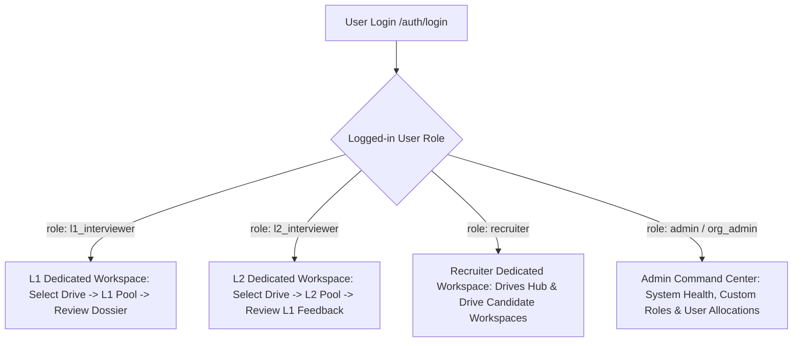

# Feature Specification: Strict Role-Based Access Control (RBAC) & View Authorization

**Feature Directory**: `specs/002-streamlined-recruitment-pipeline/`  
**Status**: Approved & Specified  
**Version**: 2.4.0  
**Domain**: Enterprise Recruitment, Strict RBAC & Isolated Workspaces  

---

## 1. Overview & Strict RBAC Enforcement Model

Each user account is assigned an explicit system role (`admin`, `recruiter`, `l1_interviewer`, `l2_interviewer`). Upon logging in, the frontend and backend **strictly enforce access control**:
1. **L1 Interviewers** can ONLY access the **L1 Technical Pool** for their selected drive. They **CANNOT** see or switch to the Recruiter Portal, L2 Pool, or Admin Command center.
2. **L2 Interviewers** can ONLY access the **L2 Panel Pool** for their selected drive. They **CANNOT** see or switch to the L1 Pool, Recruiter Portal, or Admin Command center.
3. **Recruiters** can ONLY access the **Recruiter Campaigns & Drive Workspace**. They **CANNOT** access Admin Governance tools.
4. **Admins** have full administrative command (System Telemetry, User & Role Governance, and oversight).

---

## 2. Strict Role Permissions Matrix

| Platform Section | `admin` | `recruiter` | `l1_interviewer` | `l2_interviewer` |
|---|:---:|:---:|:---:|:---:|
| **Admin Command & Role Management** | ✅ Accessible | 🚫 Hidden & Blocked | 🚫 Hidden & Blocked | 🚫 Hidden & Blocked |
| **Recruiter Campaigns & Drive Creation** | ✅ Accessible | ✅ Accessible | 🚫 Hidden & Blocked | 🚫 Hidden & Blocked |
| **Excel Candidate Whitelist Upload** | ✅ Accessible | ✅ Accessible | 🚫 Hidden & Blocked | 🚫 Hidden & Blocked |
| **Candidate Attempt Unlock / Reactivate** | ✅ Accessible | ✅ Accessible | 🚫 Hidden & Blocked | 🚫 Hidden & Blocked |
| **L1 Candidate Pool & Review Dossier** | ✅ Accessible | ✅ Accessible | ✅ Accessible (Selected Drive) | 🚫 Hidden & Blocked |
| **L2 Candidate Pool & L1 Notes Review** | ✅ Accessible | ✅ Accessible | 🚫 Hidden & Blocked | ✅ Accessible (Selected Drive) |

---

## 3. Functional Requirements

- **`FR-RBAC-001`**: The dashboard header and workspace selector shall ONLY render the sections authorized for the user's active role.
- **`FR-RBAC-002`**: When an `l1_interviewer` logs in, they are immediately locked into the L1 Technical Pool view with a drive selector. Navigation or switching to Admin/Recruiter/L2 views is strictly disabled.
- **`FR-RBAC-003`**: When an `l2_interviewer` logs in, they are immediately locked into the L2 Panel Pool view with a drive selector. Navigation or switching to Admin/Recruiter/L1 views is strictly disabled.
- **`FR-RBAC-004`**: When a `recruiter` logs in, they see the Recruiter Campaigns Hub and can enter drive workspaces. The Admin Command & Role Allocation sections are hidden and forbidden.
- **`FR-RBAC-005`**: All backend endpoints shall enforce role checking via `require_roles(...)`, returning `403 Forbidden` if an unauthorized user calls them.
